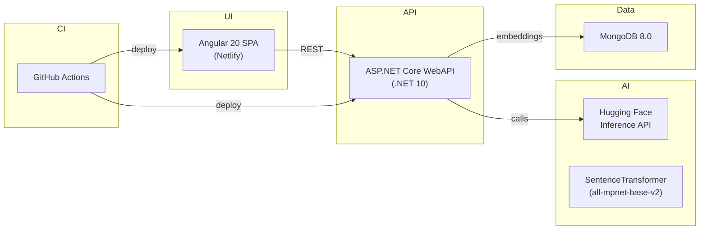

# Architecture Overview

AskMyDocs follows **Clean Architecture** — decoupling domain, application logic, and infrastructure...

```mermaid
flowchart LR
  subgraph UI
    A["Angular 20 SPA<br/>(Netlify)"]
  end
  subgraph API
    B["ASP.NET Core WebAPI<br/>(.NET 10)"]
  end
  subgraph AI
    HF["Hugging Face<br/>Inference API"]
    EMB["SentenceTransformer<br/>(all-mpnet-base-v2)"]
  end
  subgraph Data
    M["MongoDB 8.0"]
  end
  A -->|REST| B
  B -->|embeddings| M
  B -->|calls| HF
  subgraph CI
    GH["GitHub Actions"]
  end
  GH -->|deploy| B
  GH -->|deploy| A
```
