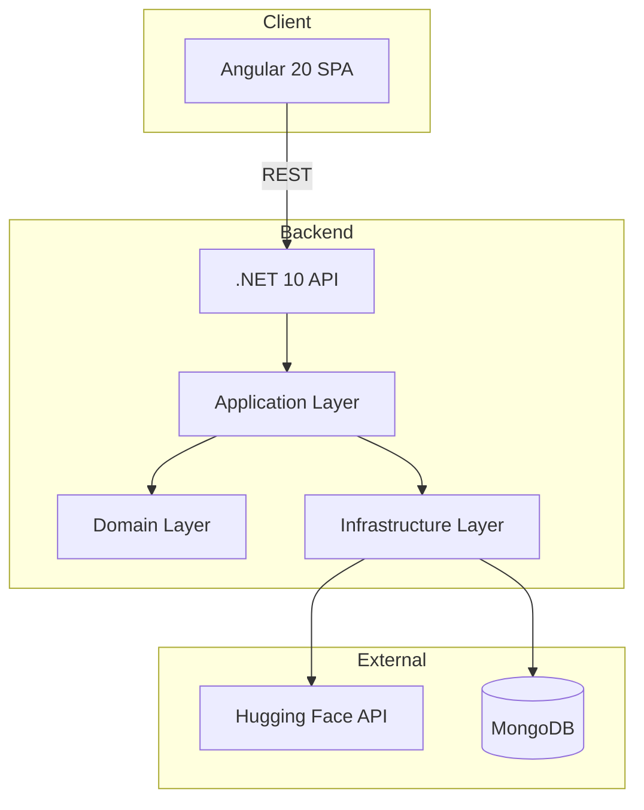
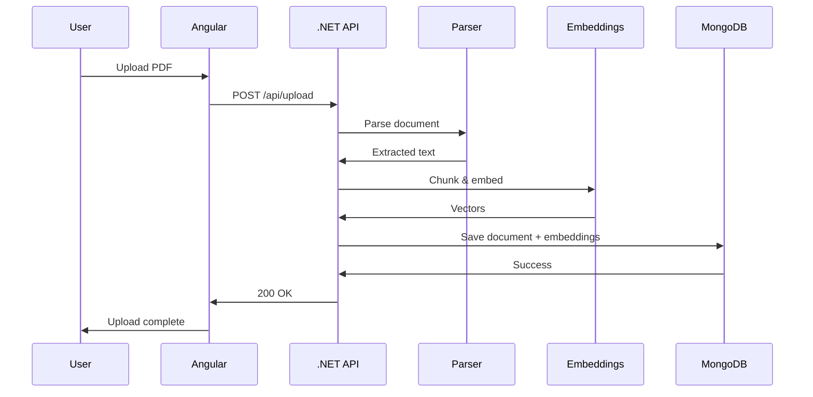
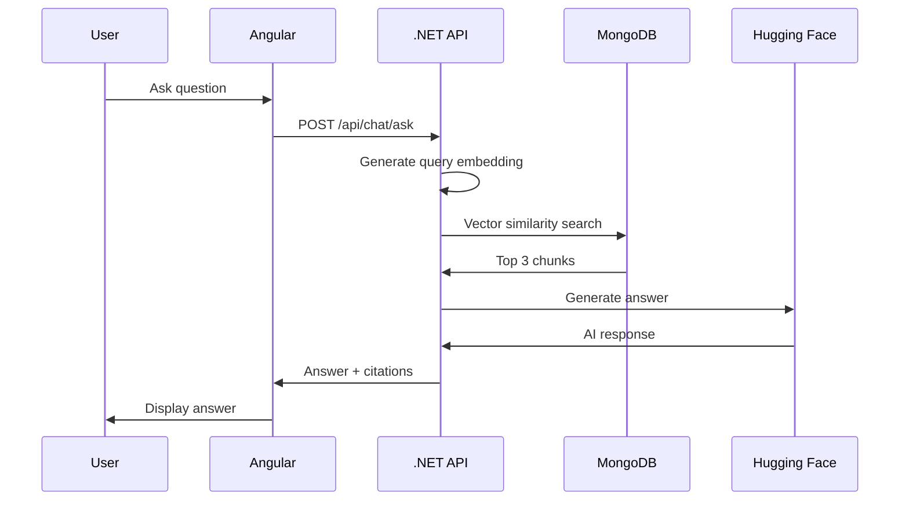

# 🏗️ System Architecture

AskMyDocs follows **Clean Architecture** with clear separation of concerns.

---

## High-Level Architecture



---

## Clean Architecture Layers

### 1. **Presentation Layer** (API)
- Controllers
- Middleware
- Filters
- Request/Response models

### 2. **Application Layer**
- CQRS commands/queries
- MediatR handlers
- Business logic
- DTOs & validators

### 3. **Domain Layer**
- Core entities
- Value objects
- Domain interfaces
- Business rules

### 4. **Infrastructure Layer**
- Repositories
- External API clients
- Database context
- File parsers

---

## Design Patterns

| Pattern | Purpose | Location |
|---------|---------|----------|
| **CQRS** | Separate reads/writes | Application layer |
| **MediatR** | Decouple handlers | Application layer |
| **Repository** | Abstract data access | Infrastructure |
| **Factory** | Build complex objects | Infrastructure |
| **Strategy** | File parsing logic | Infrastructure |
| **Options** | Typed configuration | All layers |
| **Middleware** | Cross-cutting concerns | Presentation |

---

## Data Flow

### Document Upload Flow



### Question Answering Flow



---

## Security Architecture

### Authentication
- **JWT tokens** with claims for Admin and upload operation
- **Custom middleware** for chat operation

### Rate Limiting
- Per-user request throttling
- Configurable limits
- Distributed-ready

### Data Protection
- Password hashing (bcrypt)
- Secure token storage (hashed the token and stored in DB)
- HTTPS enforcement

---

## Scalability Design

### Stateless API
- No server-side sessions
- JWT in headers
- Horizontally scalable

### Database Optimization
- Indexed vector search
- Connection pooling
- Sharding-ready schema

### Caching Strategy
- In-memory for documents
- Redis-ready for distributed cache

---

## Monitoring & Observability

### Logging (Serilog)
- Structured JSON logs
- Request/response tracking
- Error correlation IDs

### Health Checks
```http
GET /health

{
  "status": "Healthy",
  "totalChecks": 2,
  "checks": [
    {
      "name": "MongoDB",
      "status": "Healthy",
      "description": "MongoDB connection is healthy",
      "exception": null
    },
    {
      "name": "HuggingFace AI Service",
      "status": "Healthy",
      "description": "HuggingFace API is reachable.",
      "exception": null
    }
  ]
}
```

### Metrics
- API response times
- Error rates
- Database query performance

---

## Technology Stack

### Backend
- **.NET 10** - Runtime
- **ASP.NET Core** - Web framework
- **MongoDB.Driver** - Database client
- **MediatR** - CQRS implementation
- **FluentValidation** - Request validation
- **Polly** - Resilience & retry

### Frontend
- **Angular 20** - Framework
- **PrimeNG** - UI components
- **Tailwind CSS** - Styling
- **RxJS** - Reactive programming
- **TypeScript** - Type safety

### AI & ML
- **Hugging Face Inference API** - LLM
- **Sentence Transformers** - Embeddings (all-mpnet-base-v2)

### Infrastructure
- **Docker** - Containerization
- **Docker Compose** - Local orchestration
- **GitHub Actions** - CI/CD
- **Render** - API hosting
- **Netlify** - UI hosting

---

## 📚 Related Docs

- [Backend Architecture](/docs/backend)
- [AI Engine](/docs/ai-engine)
- [Deployment](/docs/deployment)
