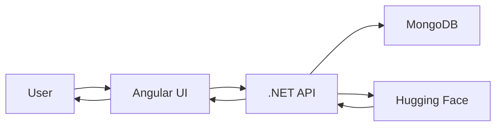

# 🧠 AskMyDocs

**AI-powered document intelligence platform** that lets you query PDFs, Word docs, and text files using natural language.

:::tip Live Demo
**Frontend:** [askmydocuments.netlify.app](https://askmydocuments.netlify.app)  
**API Docs:** [askmydocs-0dfe.onrender.com/scalar](https://askmydocs-0dfe.onrender.com/scalar)
:::

---

## ⚡ Quick Start

```bash
git clone https://github.com/poovarasasiva/askmydocs-api.git
cd askmydocs-api
docker-compose up --build
```

- **Frontend:** http://localhost:4200
- **Backend:** http://localhost:5000/scalar

---

## 🎯 Core Features

- **📤 Smart Upload** - PDF, DOCX, TXT support
- **🔍 Semantic Search** - Vector-based retrieval
- **💬 AI Q&A** - Contextual answers with citations
- **🔐 Secure** - JWT auth + rate limiting

---

## 🏗️ Tech Stack

| Layer | Technology |
|-------|------------|
| **Backend** | .NET 10, ASP.NET Core |
| **Frontend** | Angular 20, PrimeNG, Tailwind |
| **Database** | MongoDB 8.0 |
| **AI** | Hugging Face (all-mpnet-base-v2) |
| **Deploy** | Render (API) + Netlify (UI) |

---

## 📊 System Overview



**Flow:**
1. Upload document → Parse & chunk
2. Generate embeddings → Store in MongoDB
3. Ask question → Vector search → LLM answer

---

## 🚀 Use Cases

- **Legal** - Query contracts and legal docs
- **Research** - Search academic papers
- **Corporate** - Internal knowledge base
- **Technical** - Searchable API documentation

---

## 📚 Documentation

- [Getting Started](/docs/getting-started) - Installation & setup
- [Architecture](/docs/architecture) - System design
- [Backend](/docs/backend) - .NET API details
- [AI Engine](/docs/ai-engine) - How embeddings work
- [Deployment](/docs/deployment) - Docker & CI/CD

---

## 🤝 Contributing

Found a bug? Want a feature? [Open an issue](https://github.com/poovarasasiva/askmydocs-api/issues)

---

## 📄 License

MIT License - See [LICENSE](https://github.com/poovarasasiva/askmydocs-api/blob/main/LICENSE)

> "Good engineering is invisible — until something breaks."

---